# GitHub Copilot SDK - Multi-Step App Generator

A host application that demonstrates how to use the **GitHub Copilot SDK** to programmatically create applications through natural language prompts with **multi-step orchestration**.

## Table of Contents

- [Overview](#overview)
- [What's New in v2](#whats-new-in-v2)
- [Architecture](#architecture)
- [Supported Archetypes](#supported-archetypes)
- [How It Works](#how-it-works)
- [Running the Application](#running-the-application)

---

## Overview

This application showcases the **GitHub Copilot SDK** capabilities by building a "Multi-Step App Generator" - a web-based tool that:

1. Accepts natural language descriptions + optional BRD/specification documents
2. Offers multiple **architecture archetypes** (FastAPI, React+FastAPI, Node.js)
3. Uses **phase-by-phase generation** with user confirmation between each step
4. Creates files, validates code, runs tests, and deploys to Docker

**Key Value Proposition**: Instead of single-shot generation that often fails on complex specs, this approach breaks generation into manageable phases with validation and user oversight.

---

## What's New in v2

| Feature | v1 (Single-Shot) | v2 (Multi-Step) |
|---------|------------------|-----------------|
| Generation | All at once | Phase by phase |
| User Control | None | Confirm each phase |
| Validation | Only at end | After each phase |
| Complex Specs | Often incomplete | Manageable chunks |
| Architecture | Hardcoded FastAPI | Multiple archetypes |
| Pydantic | v1 syntax issues | Auto-fixed for v2 |

---

## Supported Archetypes

| Archetype | Tech Stack | Phases |
|-----------|------------|--------|
| **FastAPI + SQLite** | Python, FastAPI, SQLAlchemy, pytest | Setup → Database → Schemas → Auth → CRUD → API → Tests |
| **React + FastAPI** | React, TypeScript, Vite, FastAPI | Backend phases + Frontend phases |
| **Node.js + Express** | Node.js, Express, SQLite, Jest | Setup → Database → Models → Auth → Routes → Tests |
| **Custom** | AI-determined | AI proposes phases based on requirements |

---

## Architecture

```mermaid
flowchart TB
    subgraph HostApp["HOST APPLICATION v2"]
        Browser["🌐 Web Browser<br/>localhost:3000"]
        Express["Express Server<br/>index_v2.js"]
        
        subgraph Orchestrator["ORCHESTRATION LAYER"]
            Phases["Phase Manager<br/>• Select archetype<br/>• Track progress<br/>• Validate output"]
            Confirmation["User Confirmation<br/>• Propose phase<br/>• Wait for proceed<br/>• Handle skip"]
        end
        
        SDK["GitHub Copilot SDK<br/>@github/copilot-sdk"]
        
        subgraph CLI["COPILOT CLI"]
            AgentRuntime["Agent Runtime"]
            ToolExecutor["Tool Executor"]
        end
        
        Browser -->|"1. Select archetype"| Express
        Express --> Orchestrator
        Orchestrator -->|"2. Propose phase"| Browser
        Browser -->|"3. Confirm"| Orchestrator
        Orchestrator -->|"4. Generate"| SDK
        SDK <-->|"JSON-RPC"| CLI
    end
    
    subgraph CopilotService["GITHUB COPILOT SERVICE"]
        subgraph Models["LLM MODELS"]
            GPT41["GPT-4.1<br/>(default)"]
            GPT5["GPT-5"]
            Sonnet["Claude<br/>Sonnet 4.5"]
            Haiku["Claude<br/>Haiku 4.5"]
        end
        Auth["AUTHENTICATION & BILLING<br/>GitHub Copilot subscription"]
    end
    
    CLI <-->|"HTTPS (Authenticated)"| CopilotService
    
    subgraph LocalFS["LOCAL FILESYSTEM"]
        Workspaces["workspaces/<br/>└── fast_api_manages_app/<br/>    ├── README.md<br/>    ├── requirements.txt<br/>    ├── app/main.py<br/>    └── tests/test_main.py"]
    end
    
    subgraph Docker["DOCKER CONTAINER"]
        PyRunner["py-runner (Python 3.11)<br/>• Mounts /workspace<br/>• Creates venv<br/>• Runs pytest"]
    end
    
    SDK -->|"write_file tool"| LocalFS
    Express -->|"Run tests"| Docker
    Docker -->|"Mount"| LocalFS

    style HostApp fill:#e8f4f8,stroke:#0969da
    style CopilotService fill:#f6f8fa,stroke:#57606a
    style LocalFS fill:#dafbe1,stroke:#1a7f37
    style Docker fill:#fff8c5,stroke:#9a6700
    style CLI fill:#f0f0f0,stroke:#666
```



---

## How It Works

### Step-by-Step Flow


---

## SDK and CLI Requirements

### The `--server` Flag Issue

When we first built this application, we encountered this error:

```
[CLI subprocess] error: unknown option '--server'
```

**Root Cause**: The GitHub Copilot SDK communicates with the Copilot CLI via JSON-RPC. The SDK expects the CLI to run in "server mode" where it listens for commands over a protocol. Older CLI versions didn't have this capability.

### Version Requirements

| Component | Minimum Version | We Used | Notes |
|-----------|-----------------|---------|-------|
| `@github/copilot-sdk` | 0.1.x | **0.1.19** | Latest npm package |
| `@github/copilot` (CLI) | 0.0.380+ | **0.0.397** | Must have `--acp` flag |
| Node.js | 18+ | 18+ | For ES modules |

### How to Update

```bash
# Update the SDK
npm update @github/copilot-sdk

# Update the CLI
npm update -g @github/copilot
```

### CLI Server Mode

The SDK spawns the CLI with the `--acp` flag (Agent Client Protocol):

```
copilot --acp --port <random>
```

This starts the CLI as a JSON-RPC server that the SDK can communicate with programmatically.

---

## Custom Tools

### What Are Tools?

Tools are functions that the **LLM can decide to call** during its reasoning process. When you define a tool:

1. You describe what it does (description)
2. You define what parameters it accepts (JSON schema)
3. You provide a handler function that executes when called

The LLM sees these tool definitions and can choose to invoke them as part of generating its response.

### Tools We Defined

```javascript
// In agent_backend.js

// Tool 1: Write files to the workspace
defineTool("write_file", {
  description: "Write content to a file in the project workspace",
  parameters: {
    type: "object",
    properties: {
      filePath: { type: "string", description: "Relative path to the file" },
      content: { type: "string", description: "The full content to write" },
    },
    required: ["filePath", "content"],
  },
  handler: async ({ filePath, content }) => {
    // Sanitize path, create directories, write file
    fs.writeFileSync(fullPath, content, "utf8");
    return { success: true, path: filePath };
  },
});

// Tool 2: Read files from the workspace
defineTool("read_file", {
  description: "Read the content of a file from the project workspace",
  parameters: { ... },
  handler: async ({ filePath }) => {
    return { content: fs.readFileSync(fullPath, "utf8") };
  },
});

// Tool 3: List files in the workspace
defineTool("list_files", {
  description: "List all files in the project workspace",
  parameters: { ... },
  handler: async ({ directory }) => {
    return { files: listRecursive(targetDir) };
  },
});
```

### How Files Get Created

```mermaid
flowchart LR
    subgraph Step1["1️⃣ User Prompt"]
        Prompt["'Create a FastAPI app<br/>for managing books'"]
    end
    
    subgraph Step2["2️⃣ System Message"]
        SysMsg["Instructs LLM:<br/>'Use write_file tool<br/>for each file'"]
    end
    
    subgraph Step3["3️⃣ LLM Decision"]
        LLMResponse["tool_calls: [{<br/>  name: 'write_file',<br/>  arguments: {<br/>    filePath: 'app/main.py',<br/>    content: '...'<br/>  }<br/>}]"]
    end
    
    subgraph Step4["4️⃣ SDK Executes Handler"]
        Handler["handler({ filePath, content })<br/>↓<br/>fs.writeFileSync(...)"]
    end
    
    subgraph Step5["5️⃣ Result Chain"]
        Chain["Handler → SDK → CLI → LLM"]
    end
    
    subgraph Step6["6️⃣ Loop"]
        Loop["LLM creates next file...<br/>Repeat until done"]
    end
    
    Step1 --> Step2 --> Step3 --> Step4 --> Step5 --> Step6
    Step6 -.->|"More files"| Step3

    style Step1 fill:#dbeafe,stroke:#2563eb
    style Step2 fill:#fef3c7,stroke:#d97706
    style Step3 fill:#e0e7ff,stroke:#4f46e5
    style Step4 fill:#d1fae5,stroke:#059669
    style Step5 fill:#fce7f3,stroke:#db2777
    style Step6 fill:#f3f4f6,stroke:#6b7280
```



---

## The Agent Loop

### Is This Using an "Agent" or Just a Model?

**Yes, this is using Copilot's Agent capabilities**, not just a simple chat completion.

The key difference:

| Simple LLM Call | Agent Mode (What We Use) |
|-----------------|--------------------------|
| Single request → response | Multi-turn planning and execution |
| No tool calling | Can call tools (write_file, etc.) |
| No persistent state | Session with context management |
| No reasoning loop | Plans → executes → evaluates → continues |

### The Agentic Loop

```mermaid
flowchart TD
    A["👤 USER PROMPT<br/>'Create a FastAPI app for<br/>managing books with CRUD'"] --> B
    
    B["🧠 PLANNING<br/>I need to create:<br/>• README.md<br/>• requirements.txt<br/>• app/__init__.py<br/>• app/main.py<br/>• tests/__init__.py<br/>• tests/test_main.py"] --> C
    
    C["🔧 TOOL CALL<br/>write_file<br/>(README.md)"] --> D
    
    D["✅ TOOL RESULT<br/>{ success: true }"] --> E
    
    E{"🔄 EVALUATE<br/>Continue with<br/>next file?"}
    
    E -->|"More files"| C
    E -->|"All done"| F
    
    F["📝 SUMMARIZE<br/>All files created..."] --> G
    
    G["💤 SESSION IDLE<br/>Generation complete"]

    style A fill:#dbeafe,stroke:#2563eb
    style B fill:#fef3c7,stroke:#d97706
    style C fill:#e0e7ff,stroke:#4f46e5
    style D fill:#d1fae5,stroke:#059669
    style E fill:#fce7f3,stroke:#db2777
    style F fill:#e0e7ff,stroke:#4f46e5
    style G fill:#f3f4f6,stroke:#6b7280
```



---

## Workspace Management

### What is a Workspace?

A workspace is a directory where all generated files for a project are stored:

```
workspaces/
├── fast_api_manages_app/           # Generated from "FastAPI app for books"
│   ├── README.md
│   ├── requirements.txt
│   ├── app/
│   │   ├── __init__.py
│   │   └── main.py
│   └── tests/
│       ├── __init__.py
│       └── test_main.py
│
├── todo_list_app/                  # Another generated project
│   └── ...
│
└── weather_api_app/                # Yet another
    └── ...
```

### Workspace Creation Flow

```javascript
// In server/index.js

// 1. Generate project name from user prompt
const projectName = generateProjectName(userPrompt, jobId);
// "Create FastAPI app for books" → "fast_api_manages_app"

// 2. Create workspace directory
const projectDir = path.join(WORKSPACES, projectName);
ensureDir(projectDir);  // Creates: workspaces/fast_api_manages_app/

// 3. Pass to Copilot SDK - tools write files here
await generateProjectWithCopilot(
  userPrompt,
  projectDir,  // ← This is the workspace
  onLog,
  onFileWrite
);
```

### Path Security

The `write_file` tool includes path sanitization to prevent directory traversal attacks:

```javascript
handler: async ({ filePath, content }) => {
  // Prevent "../../../etc/passwd" attacks
  const cleanPath = filePath
    .replace(/^(\.\.[/\\])+/, "")  // Remove leading ../
    .replace(/^[/\\]+/, "");       // Remove leading /

  const fullPath = path.join(workspaceDir, cleanPath);
  
  // Verify path stays within workspace
  if (!fullPath.startsWith(workspaceDir)) {
    throw new Error("Path traversal blocked");
  }
  
  fs.writeFileSync(fullPath, content, "utf8");
};
```

---

## LLM and Model Configuration

### Which LLM Powers This?

The Copilot SDK uses **GitHub's Copilot service** which provides access to multiple LLMs:

| Model | Provider | Notes |
|-------|----------|-------|
| `gpt-4.1` | OpenAI | **Default** - Good balance of quality/speed |
| `gpt-5` | OpenAI | Latest, most capable |
| `claude-sonnet-4.5` | Anthropic | Anthropic's Sonnet model |
| `claude-haiku-4.5` | Anthropic | Faster, lighter Anthropic model |

### How We Configure the Model

```javascript
// In agent_backend.js

const session = await client.createSession({
  model: "gpt-4.1",  // ← Change this to use different models
  streaming: true,
  tools: [fileWriterTool, fileReaderTool, fileListTool],
  systemMessage: {
    content: `You are an expert Python developer...`
  }
});
```

### Can You Use Other LLMs?

**Through GitHub Copilot**: Yes! Change the `model` parameter:

```javascript
// Use GPT-5
const session = await client.createSession({ model: "gpt-5" });

// Use Claude Sonnet
const session = await client.createSession({ model: "claude-sonnet-4.5" });
```

**BYOK (Bring Your Own Key)**: The SDK also supports using your own API keys:

```javascript
// Use your own OpenAI key
const client = new CopilotClient({
  // BYOK configuration - see SDK docs
});
```

### Will the Code Work the Same with Different Models?

**Mostly yes**, but with variations:

- **Tool calling**: All supported models can call the custom tools
- **Code quality**: GPT-5 and Claude Sonnet 4.5 may produce higher quality code
- **Speed**: Claude Haiku is faster but may be less thorough
- **System message adherence**: Different models follow instructions differently

The core architecture (tools, workspace, file writing) works identically regardless of model.

---

## Running the Application

### Prerequisites

1. **Node.js 18+**
2. **Docker Desktop** (for running tests)
3. **GitHub Copilot subscription** (required for SDK usage)
4. **Copilot CLI** installed and authenticated:
   ```bash
   npm install -g @github/copilot
   copilot --version  # Should be 0.0.380+
   ```

### Installation

```bash
cd copilot-hosting-app
npm install
```

### Running

```bash
# Start the server
node server/index.js

# Open in browser
# http://localhost:3000
```

### Environment Variables

| Variable | Default | Description |
|----------|---------|-------------|
| `PORT` | 3000 | Server port |

---

## File Structure

```
copilot-hosting-app/
├── package.json              # Node.js dependencies
├── Dockerfile.runner         # Python Docker image for tests
├── server/
│   ├── index.js              # Express server, SSE streaming
│   ├── agent_backend.js      # Copilot SDK integration, custom tools
│   ├── workspace.js          # File system utilities
│   └── docker_runner.js      # Docker execution for tests
├── ui/
│   └── index.html            # Web UI
└── workspaces/               # Generated projects go here
    └── <project_name>/
        └── ...
```

---

## Summary

This application demonstrates how the **GitHub Copilot SDK** enables you to:

1. **Embed agentic AI** into custom applications
2. **Define custom tools** that the LLM can invoke
3. **Generate complete projects** from natural language
4. **Stream responses** in real-time to users
5. **Access multiple LLMs** (GPT-4.1, GPT-5, Claude) through a unified API

The key insight is that the SDK exposes the **same agent runtime** that powers VS Code's Copilot Agent Mode and the Copilot CLI, but as a **programmable API** you can integrate into any application.
